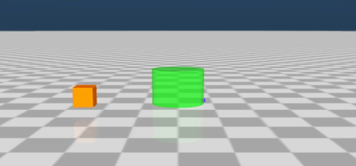

# Block Push

|   |   |
|---|---|
| Action Space | `Box(-1, +1, (2,), float32)` |
| Observation Shape | `(5,)` |
| Observation High | `Box([+2]*4 + [+np.pi], dtype=np.float32))` |
| Observation Low | `Box([-2]*4 + [-np.pi], dtype=np.float32))` |
| Import | `gymnasium.make("gymtonic/BlockPush-v0")` | 

### Description
The agent has to push the block towards the target area.

### Action Space
The action space has two continuous dimensions. The first one [-1, 1] represents the rotation to apply to the agent, the second, also in the range [-1, 1], represents the speed to move in the forward direction according to the agent orientation (negative values move backwards). 

### Observation Space
The state is an 5-dimensional vector representing:
- The direction vector (x,y) from the agent to the block
- The direction vector (x,y) from the agent to the target area
- The orientation difference (angle offset) between the agent and the block 

### Rewards
Rewards are distributed ass follows:
- +100 for successfully pushing the block until it enters the target area
- -d1 at avery step, where d1 is the distance between the agent and the block
- +d2 at avery step, where d2 = initial distance between the block and the target area - current distance between the block and the target area
- -0.1 per step (time penalty)

### Starting State
The agent and the block appear at random positions.

### Episode Termination
The episode finishes if:
1) the block reaches the target area
2) 500 steps are reached (episode truncated)

### Version History
- v0: Initial version

<!-- ### References -->

### Credits
Created by Inaki Vazquez
